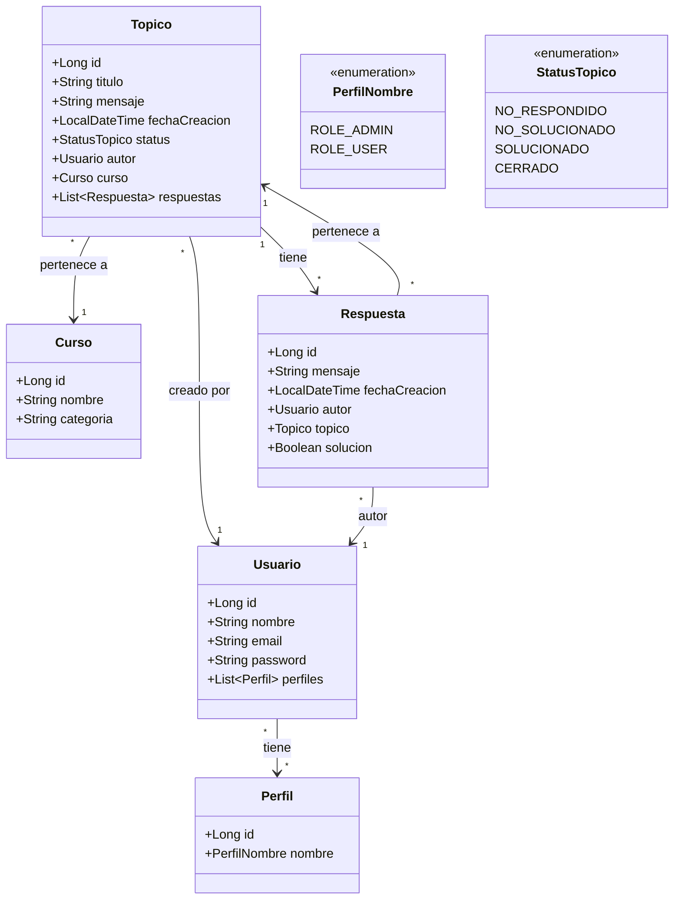

```mermaid
classDiagram
class Usuario {
+Long id
+String nombre
+String email
+String password
+List~Perfil~ perfiles
}
class Perfil {
+Long id
+PerfilNombre nombre
}
class Curso {
+Long id
+String nombre
+String categoria
}
class Topico {
+Long id
+String titulo
+String mensaje
+LocalDateTime fechaCreacion
+StatusTopico status
+Usuario autor
+Curso curso
+List~Respuesta~ respuestas
}
class Respuesta {
+Long id
+String mensaje
+LocalDateTime fechaCreacion
+Usuario autor
+Topico topico
+Boolean solucion
}
class PerfilNombre {
<<enumeration>>
ROLE_ADMIN
ROLE_USER
}
class StatusTopico {
<<enumeration>>
NO_RESPONDIDO
NO_SOLUCIONADO
SOLUCIONADO
CERRADO
}

    Usuario "*" --> "*" Perfil : tiene
    Topico "*" --> "1" Usuario : creado por
    Topico "*" --> "1" Curso : pertenece a
    Respuesta "*" --> "1" Usuario : autor
    Respuesta "*" --> "1" Topico : pertenece a
    Topico "1" --> "*" Respuesta : tiene
```