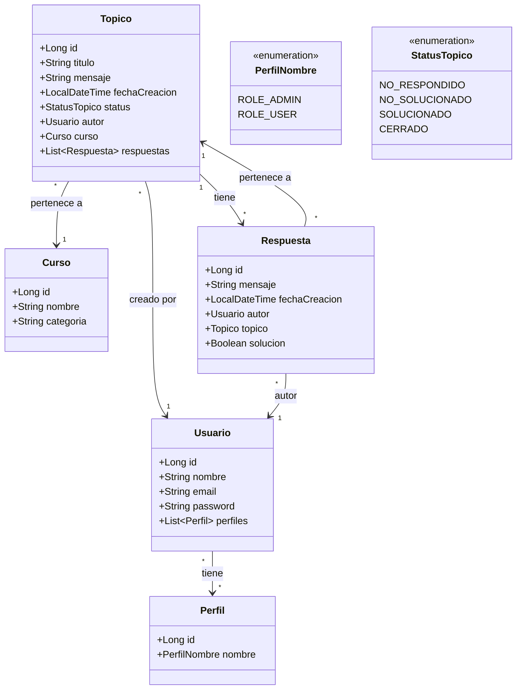
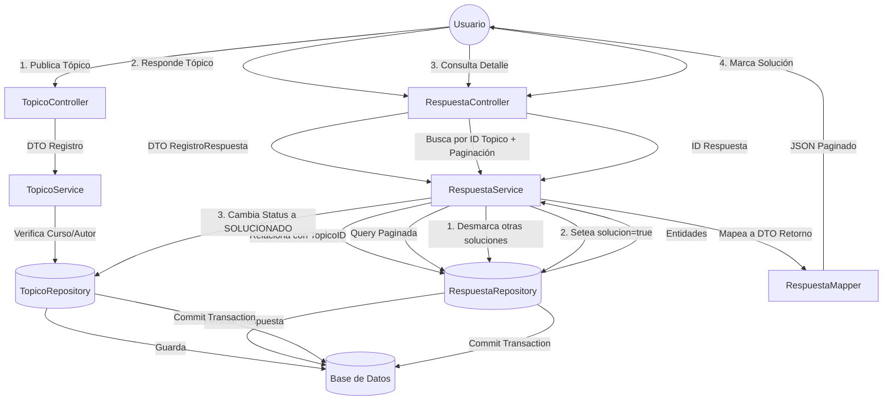

# ForoHub - Challenge Backend Alura Latam

Este proyecto es una API REST construida con **Spring Boot** para gestionar un foro de discusiones.
Permite la creación de tópicos, registro de usuarios con roles específicos y la gestión de respuestas.

