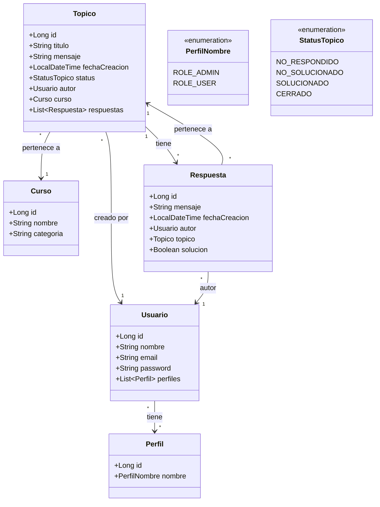
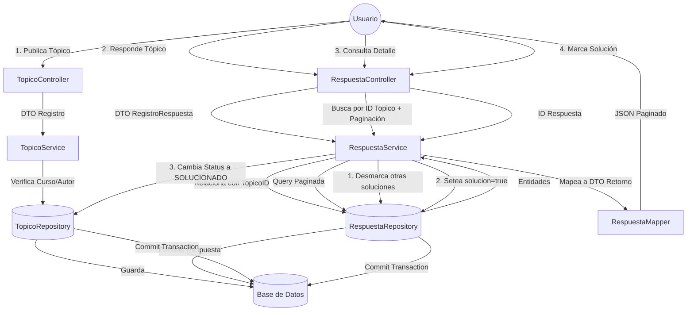
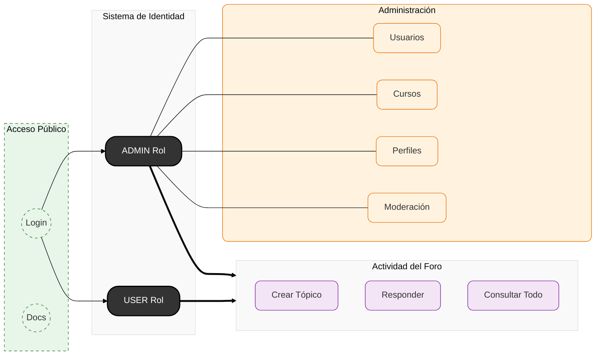
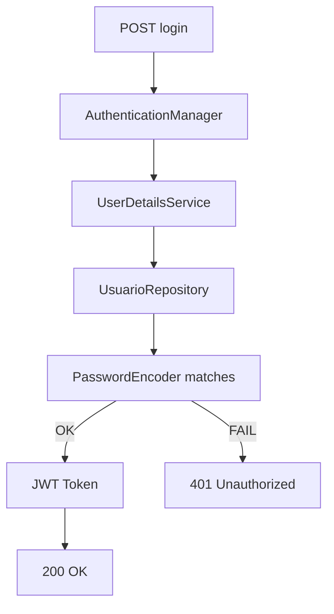
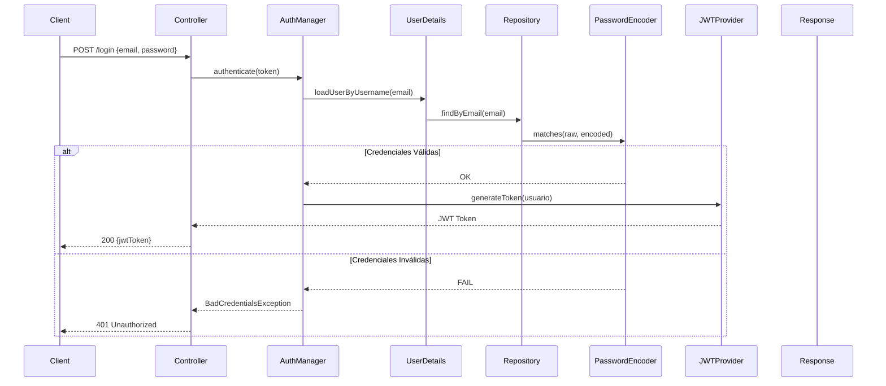
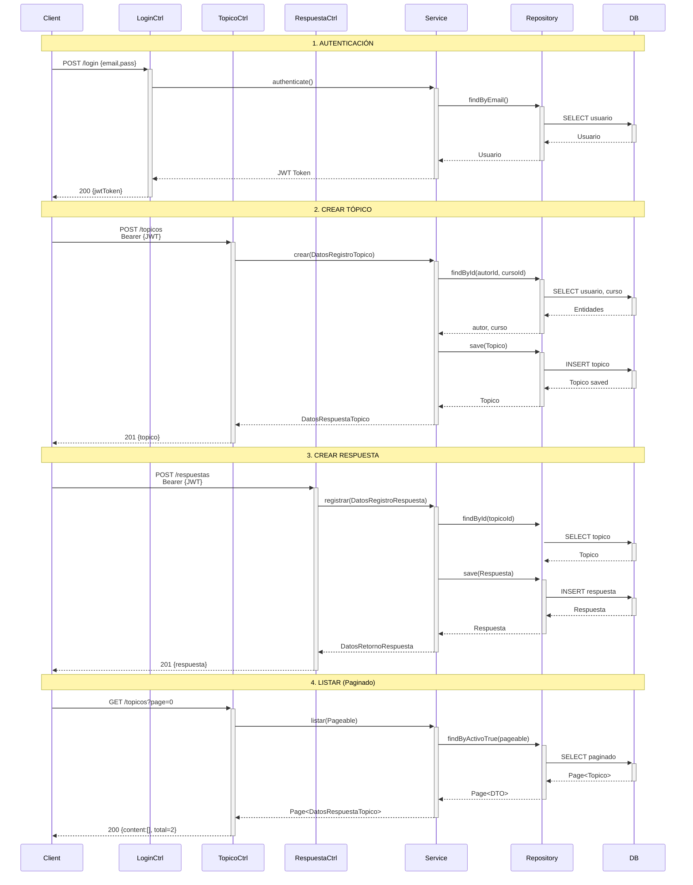

# ForoHub - Challenge Backend Alura Latam

Este proyecto es una API REST construida con **Spring Boot** para gestionar un foro de discusiones.
Permite la creación de tópicos, registro de usuarios con roles específicos y la gestión de respuestas.

```mermaid
classDiagram
class Usuario {
+Long id
+String nombre
+String email
+String password
+List~Perfil~ perfiles
}
class Perfil {
+Long id
+PerfilNombre nombre
}
class Curso {
+Long id
+String nombre
+String categoria
}
class Topico {
+Long id
+String titulo
+String mensaje
+LocalDateTime fechaCreacion
+StatusTopico status
+Usuario autor
+Curso curso
+List~Respuesta~ respuestas
}
class Respuesta {
+Long id
+String mensaje
+LocalDateTime fechaCreacion
+Usuario autor
+Topico topico
+Boolean solucion
}
class PerfilNombre {
<<enumeration>>
ROLE_ADMIN
ROLE_USER
}
class StatusTopico {
<<enumeration>>
NO_RESPONDIDO
NO_SOLUCIONADO
SOLUCIONADO
CERRADO
}

    Usuario "*" --> "*" Perfil : tiene
    Topico "*" --> "1" Usuario : creado por
    Topico "*" --> "1" Curso : pertenece a
    Respuesta "*" --> "1" Usuario : autor
    Respuesta "*" --> "1" Topico : pertenece a
    Topico "1" --> "*" Respuesta : tiene
```

```mermaid
graph TD
%% Inicio del proceso
User((Usuario)) -->|1. Publica Tópico| TC[TopicoController]
TC -->|DTO Registro| TS[TopicoService]
TS -->|Verifica Curso/Autor| TR[(TopicoRepository)]
TR -->|Guarda| DB[(Base de Datos)]

    %% Flujo de Respuesta
    User -->|2. Responde Tópico| RC[RespuestaController]
    RC -->|DTO RegistroRespuesta| RS[RespuestaService]
    RS -->|Relaciona con TopicoID| RR[(RespuestaRepository)]
    RR -->|Persiste Respuesta| DB
    
    %% Flujo de Visualización
    User -->|3. Consulta Detalle| RC
    RC -->|Busca por ID Topico + Paginación| RS
    RS -->|Query Paginada| RR
    RR -->|Entidades| RS
    RS -->|Mapea a DTO Retorno| RM[RespuestaMapper]
    RM -->|JSON Paginado| User

    %% Flujo de Solución
    User -->|4. Marca Solución| RC
    RC -->|ID Respuesta| RS
    RS -->|1. Desmarca otras soluciones| RR
    RS -->|2. Setea solucion=true| RR
    RS -->|3. Cambia Status a SOLUCIONADO| TR
    TR & RR -->|Commit Transaction| DB
```

```mermaid
%%{init: {'theme': 'base', 'themeVariables': { 'primaryColor': '#ffffff', 'edgeLabelBackground':'#ffffff', 'tertiaryColor': '#f9f9f9'}}}%%
graph LR
%% ESTILOS AVANZADOS
    classDef roles fill:#333,color:#fff,stroke:#000,stroke-width:2px,rx:20,ry:20
    classDef public fill:#e8f5e9,stroke:#2e7d32,stroke-width:1px,stroke-dasharray: 5 5
    classDef adminItem fill:#fff3e0,stroke:#ef6c00,stroke-width:1px,rx:10,ry:10
    classDef userItem fill:#e3f2fd,stroke:#1565c0,stroke-width:1px,rx:10,ry:10
    classDef sharedItem fill:#f3e5f5,stroke:#7b1fa2,stroke-width:1px,rx:10,ry:10

%% ACCESO PÚBLICO (Superior)
    subgraph Puerta[Acceso Público]
        direction LR
        Login((Login))
        Docs((Docs))
    end
    class Puerta,Login,Docs public

%% NÚCLEO DE ROLES
    subgraph Roles[Sistema de Identidad]
        direction TB
        ADMIN[ADMIN Rol]
        USER[USER Rol]
    end
    class ADMIN roles
    class USER roles

%% PERMISOS EXCLUSIVOS ADMIN (Izquierda)
    subgraph Gestion[Administración]
        direction TB
        U_Mng[Usuarios]
        C_Mng[Cursos]
        P_Mng[Perfiles]
        T_Mod[Moderación]
    end
    class Gestion,U_Mng,C_Mng,P_Mng,T_Mod adminItem

%% PERMISOS COMPARTIDOS (Derecha)
    subgraph Foro[Actividad del Foro]
        direction TB
        T_Create[Crear Tópico]
        R_Create[Responder]
        Read[Consultar Todo]
    end
    class Foro,T_Create,R_Create,Read sharedItem

%% FLUJO DE CONEXIONES
    Login --> ADMIN
    Login --> USER

%% Conexiones Admin
    ADMIN --- U_Mng
    ADMIN --- C_Mng
    ADMIN --- P_Mng
    ADMIN --- T_Mod

%% Conexiones USER y ADMIN (Compartidas)
    ADMIN ==> Foro
    USER ==> Foro
```

```mermaid
graph TD
    A[POST login] --> B[AuthenticationManager]
    B --> C[UserDetailsService]
    C --> D[UsuarioRepository]
    D --> E[PasswordEncoder matches]
    E -->|OK| F[JWT Token]
    E -->|FAIL| G[401 Unauthorized]
    F --> H[200 OK]
```

```mermaid
sequenceDiagram
    participant Client
    participant Controller
    participant AuthManager
    participant UserDetails
    participant Repository
    participant PasswordEncoder
    participant JWTProvider
    participant Response
    
    Client->>Controller: POST /login {email, password}
    Controller->>AuthManager: authenticate(token)
    AuthManager->>UserDetails: loadUserByUsername(email)
    UserDetails->>Repository: findByEmail(email)
    Repository->>PasswordEncoder: matches(raw, encoded)
    alt Credenciales Válidas
        PasswordEncoder-->>AuthManager: OK
        AuthManager->>JWTProvider: generateToken(usuario)
        JWTProvider-->>Controller: JWT Token
        Controller-->>Client: 200 {jwtToken}
    else Credenciales Inválidas
        PasswordEncoder-->>AuthManager: FAIL
        AuthManager-->>Controller: BadCredentialsException
        Controller-->>Client: 401 Unauthorized
    end
```

sequenceDiagram
participant Client
participant Controller
participant AuthManager
participant UserDetails
participant Repository
participant PasswordEncoder
participant JWTProvider
participant Response
[...diagram...]

Flujo de autenticación estándar Spring Security + JWT:

POST /login envía DatosAutenticacionUsuario (email, password)

UsernamePasswordAuthenticationToken → AuthenticationManager.authenticate()

Spring Security ejecuta:

UserDetailsService.loadUserByUsername(email)

PasswordEncoder.matches(passwordRaw, passwordEncoded)

Éxito: jwtTokenProvider.generateToken(usuario) → DatosJWTToken

Error: BadCredentialsException → 401 Unauthorized

Características:

✅ Passwords codificados con BCryptPasswordEncoder

✅ JWT stateless (sin sesiones)

✅ Roles en JWT para @PreAuthorize

✅ Automático con Spring Security chain

Uso: Bearer {jwtToken} en headers de endpoints protegidos.

```mermaid
sequenceDiagram
    participant Client
    participant LoginCtrl
    participant TopicoCtrl
    participant RespuestaCtrl
    participant Service
    participant Repository
    participant DB
    
    Note over Client,DB: 1. AUTENTICACIÓN
    Client->>+LoginCtrl: POST /login {email,pass}
    LoginCtrl->>+Service: authenticate()
    Service->>+Repository: findByEmail()
    Repository->>+DB: SELECT usuario
    DB-->>-Repository: Usuario
    Repository-->>-Service: Usuario
    Service-->>-LoginCtrl: JWT Token
    LoginCtrl-->>-Client: 200 {jwtToken}
    
    Note over Client,DB: 2. CREAR TÓPICO
    Client->>+TopicoCtrl: POST /topicos<br/>Bearer {JWT}
    TopicoCtrl->>+Service: crear(DatosRegistroTopico)
    Service->>+Repository: findById(autorId, cursoId)
    Repository->>+DB: SELECT usuario, curso
    DB-->>-Repository: Entidades
    Repository-->>-Service: autor, curso
    Service->>+Repository: save(Topico)
    Repository->>+DB: INSERT topico
    DB-->>-Repository: Topico saved
    Repository-->>-Service: Topico
    Service-->>-TopicoCtrl: DatosRespuestaTopico
    TopicoCtrl-->>-Client: 201 {topico}
    
    Note over Client,DB: 3. CREAR RESPUESTA
    Client->>+RespuestaCtrl: POST /respuestas<br/>Bearer {JWT}
    RespuestaCtrl->>+Service: registrar(DatosRegistroRespuesta)
    Service->>+Repository: findById(topicoId)
    Repository->>+DB: SELECT topico
    DB-->>-Repository: Topico
    Service->>+Repository: save(Respuesta)
    Repository->>+DB: INSERT respuesta
    DB-->>-Repository: Respuesta
    Repository-->>-Service: Respuesta
    Service-->>-RespuestaCtrl: DatosRetornoRespuesta
    RespuestaCtrl-->>-Client: 201 {respuesta}
    
    Note over Client,DB: 4. LISTAR (Paginado)
    Client->>+TopicoCtrl: GET /topicos?page=0
    TopicoCtrl->>+Service: listar(Pageable)
    Service->>+Repository: findByActivoTrue(pageable)
    Repository->>+DB: SELECT paginado
    DB-->>-Repository: Page<Topico>
    Repository-->>-Service: Page<DTO>
    Service-->>-TopicoCtrl: Page<DatosRespuestaTopico>
    TopicoCtrl-->>-Client: 200 {content:[], total=2}
```