## 🏆 Foro Hub: API REST con Moderación Inteligente

<p align="center">
  
  
  
  
</p>

<p align="center">
  
  
  
  
  <a href="LICENSE"></a>
</p>

---

Foro Hub es una solución backend robusta para la gestión de comunidades digitales, desarrollada como parte del desafío
de formación en el programa Alura/Oracle Next Education.   
El proyecto no solo replica el funcionamiento de un foro tradicional, sino que eleva el estándar mediante la
implementación de seguridad avanzada y   
validación de contenidos con Inteligencia Artificial.
___

## 💡 El Desafío

El objetivo principal fue construir una API escalable que gestionara tópicos de discusión, respuestas y perfiles de
usuario, garantizando la integridad de los datos y una    
experiencia de usuario segura y fluida.
___

## 🛠️ Diferenciadores Tecnológicos

🔐 Seguridad de Grado Industrial

Implementación de Spring Security con autenticación JWT (Stateless), asegurando que cada interacción esté protegida y
vinculada a roles específicos (ADMIN/USER).
___

## 🤖 Moderación con Google Gemini AI

Integración de modelos de lenguaje natural para interceptar y analizar respuestas en tiempo real, bloqueando
automáticamente contenidos ofensivos antes de que    
lleguen a la base de datos.
___

## 💾 Resiliencia de Datos

Uso de Borrado Lógico (Soft Delete) mediante anotaciones de Hibernate (@SQLRestriction), permitiendo la recuperación de
información y manteniendo la trazabilidad   
sin pérdida de registros físicos.
___

## 📊 Observabilidad

Monitoreo detallado del consumo de la API de IA (tokens y latencia) mediante el patrón de diseño Decorator, permitiendo
un control total sobre los costos y el rendimiento.
___

## 🏗️ Diseño de Código Limpio

Arquitectura basada en principios SOLID, utilizando DTOs para la transferencia de datos y una clara separación de
responsabilidades entre controladores, servicios y repositorios.
___

## 🎯 Impacto del Proyecto

Este proyecto demuestra la capacidad de integrar servicios modernos de IA en ecosistemas tradicionales de Java/Spring,
logrando una plataforma que no solo almacena información,    
sino que entiende y protege el contenido generado por su comunidad.
___

### 🛠️ Tecnologías y Recursos Utilizados

| Dependencia / Herramienta | Documentación Oficial                                                                                  |
|:--------------------------|:-------------------------------------------------------------------------------------------------------|
| **Spring Boot 3.x**       | [Framework Base](https://spring.io/projects/spring-boot)                                               |
| **Spring Security**       | [Autenticación y RBAC](https://spring.io/projects/spring-security)                                     |
| **Spring AI Gemini**      | [Integración Google GenAI](https://docs.spring.io/spring-ai/reference/api/chat/google-genai-chat.html) |
| **Spring AI Mistral**     | 	[Integración Mistral AI](https://docs.spring.io/spring-ai/reference/api/chatmodel.html) |                                                                        |
| **SpringDoc OpenAPI**     | [Swagger UI Docs](https://springdoc.org/)                                                              |
| **MySQL Connector**       | [Persistencia de Datos](https://dev.mysql.com/downloads/connector/j/)                                  |
| **JJWT**                  | [Implementación de Tokens JWT](https://github.com/jwtk/jjwt)                                           |
| **JTokkit**               | [Conteo de Tokens IA](https://github.com/knuddelsgmbh/jtokkit)                                         |
| **Lombok**                | [Productividad y Boilerplate](https://projectlombok.org/)                                              |
| **Spring Initializr**     | [Bootstrap del Proyecto](https://start.spring.io/)                                                     |

---

> [!NOTE]
> Esta tabla refleja el **Stack Tecnológico** completo del proyecto, abarcando desde la infraestructura base hasta los servicios de Inteligencia Artificial y seguridad perimetral.
___

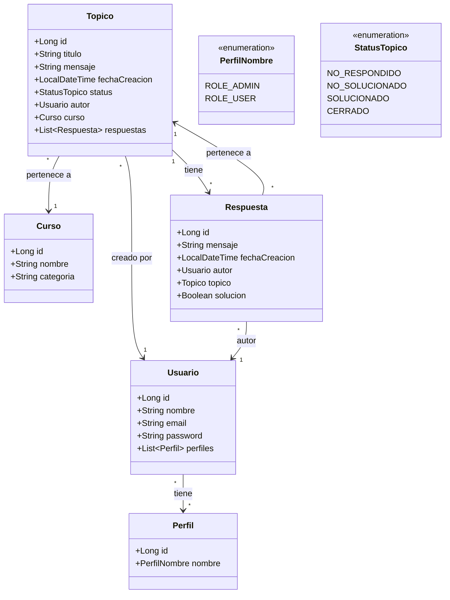
```mermaid
classDiagram
    class Usuario {
        +Long id
        +String nombre
        +String email
        +String password
        +List~Perfil~ perfiles
    }
    class Perfil {
        +Long id
        +PerfilNombre nombre
    }
    class Curso {
        +Long id
        +String nombre
        +String categoria
    }
    class Topico {
        +Long id
        +String titulo
        +String mensaje
        +LocalDateTime fechaCreacion
        +StatusTopico status
        +Usuario autor
        +Curso curso
        +List~Respuesta~ respuestas
    }
    class Respuesta {
        +Long id
        +String mensaje
        +LocalDateTime fechaCreacion
        +Usuario autor
        +Topico topico
        +Boolean solucion
    }
    class PerfilNombre {
        <<enumeration>>
        ROLE_ADMIN
        ROLE_USER
    }
    class StatusTopico {
        <<enumeration>>
        NO_RESPONDIDO
        NO_SOLUCIONADO
        SOLUCIONADO
        CERRADO
    }

    Usuario "*" --> "*" Perfil: tiene
    Topico "*" --> "1" Usuario: creado por
    Topico "*" --> "1" Curso: pertenece a
    Respuesta "*" --> "1" Usuario: autor
    Respuesta "*" --> "1" Topico: pertenece a
    Topico "1" --> "*" Respuesta: tiene
```

___

## Flujo completo de Tópicos y Respuestas en Foro con Spring Boot

Diagrama Mermaid que resume la gestión de publicaciones, respuestas, consultas paginadas y marcado de soluciones en una
app de foro, integrando controladores, servicios, repositorios y transacciones.

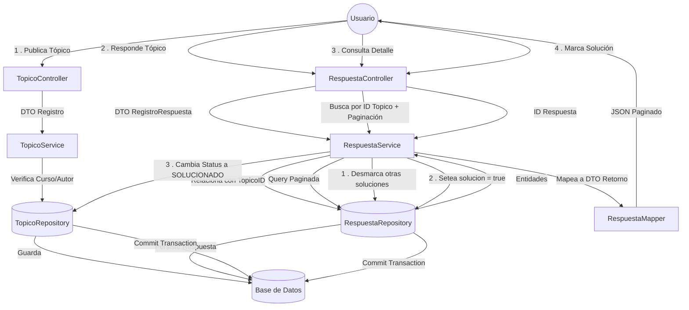
```mermaid
graph TD
%% Inicio del proceso
    User((Usuario)) -->|1 . Publica Tópico| TC[TopicoController]
    TC -->|DTO Registro| TS[TopicoService]
    TS -->|Verifica Curso/Autor| TR[(TopicoRepository)]
    TR -->|Guarda| DB[(Base de Datos)]
%% Flujo de Respuesta
    User -->|2 . Responde Tópico| RC[RespuestaController]
    RC -->|DTO RegistroRespuesta| RS[RespuestaService]
    RS -->|Relaciona con TopicoID| RR[(RespuestaRepository)]
    RR -->|Persiste Respuesta| DB
%% Flujo de Visualización
    User -->|3 . Consulta Detalle| RC
    RC -->|Busca por ID Topico + Paginación| RS
    RS -->|Query Paginada| RR
    RR -->|Entidades| RS
    RS -->|Mapea a DTO Retorno| RM[RespuestaMapper]
    RM -->|JSON Paginado| User
%% Flujo de Solución
    User -->|4 . Marca Solución| RC
    RC -->|ID Respuesta| RS
    RS -->|1 . Desmarca otras soluciones| RR
    RS -->|2 . Setea solucion = true| RR
    RS -->|3 . Cambia Status a SOLUCIONADO| TR
    TR & RR -->|Commit Transaction| DB
```

___
🔐 Arquitectura de Seguridad y Roles
El proyecto implementa un control de acceso basado en roles (RBAC) mediante Spring Security y JWT, asegurando que cada
recurso sea accesible solo por el personal autorizado.

Descripción del Flujo:
Acceso Público: Los puntos de entrada como el Login y la documentación de la API (Swagger/SpringDoc) están abiertos para
facilitar el acceso y la integración.

Sistema de Identidad: Tras la autenticación, el sistema identifica dos perfiles principales:

ADMIN: Posee control total sobre la infraestructura del foro, incluyendo la gestión de usuarios, cursos, perfiles y la
supervisión de la moderación de contenido.

USER: Perfil enfocado en la interacción y colaboración dentro de la comunidad.

Actividad del Foro (Permisos Compartidos): Ambos roles pueden participar activamente creando tópicos, respondiendo a
debates y consultando la base de conocimientos, promoviendo una dinámica fluida de intercambio de información.

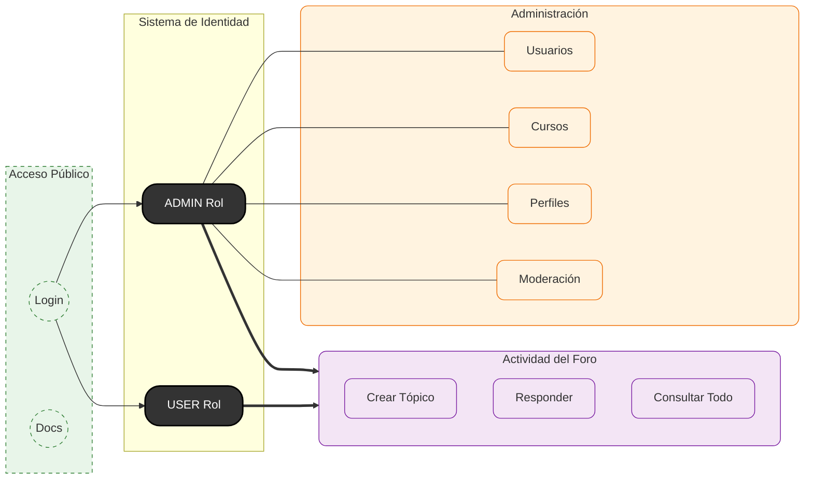
```mermaid
graph LR
%% ESTILOS AVANZADOS
    classDef roles fill:#333,color:#fff,stroke:#000,stroke-width:2px,rx:20,ry:20
    classDef public fill:#e8f5e9,stroke:#2e7d32,stroke-width:1px,stroke-dasharray:5 5
    classDef adminItem fill:#fff3e0,stroke:#ef6c00,stroke-width:1px,rx:10,ry:10
    classDef userItem fill:#e3f2fd,stroke:#1565c0,stroke-width:1px,rx:10,ry:10
    classDef sharedItem fill:#f3e5f5,stroke:#7b1fa2,stroke-width:1px,rx:10,ry:10

%% ACCESO PÚBLICO
    subgraph Puerta[Acceso Público]
        direction LR
        Login((Login))
        Docs((Docs))
    end

%% NÚCLEO DE ROLES
    subgraph Roles[Sistema de Identidad]
        direction TB
        ADMIN[ADMIN Rol]
        USER[USER Rol]
    end

%% PERMISOS EXCLUSIVOS ADMIN
    subgraph Gestion[Administración]
        direction TB
        U_Mng[Usuarios]
        C_Mng[Cursos]
        P_Mng[Perfiles]
        T_Mod[Moderación]
    end

%% PERMISOS COMPARTIDOS
    subgraph Foro[Actividad del Foro]
        direction TB
        T_Create[Crear Tópico]
        R_Create[Responder]
        Read[Consultar Todo]
    end

%% FLUJO DE CONEXIONES
    Login --> ADMIN
    Login --> USER
    ADMIN --- U_Mng
    ADMIN --- C_Mng
    ADMIN --- P_Mng
    ADMIN --- T_Mod
    ADMIN ==> Foro
    USER ==> Foro

%% ASIGNACIÓN DE CLASES (IMPORTANTE: Sin espacios entre comas)
    class Login,Docs,Puerta public
    class ADMIN,USER roles
    class Gestion,U_Mng,C_Mng,P_Mng,T_Mod adminItem
    class Foro,T_Create,R_Create,Read sharedItem
```

Este diagrama representa la jerarquía de permisos donde la administración y la participación activa se separan para
garantizar la integridad de los datos y la seguridad del sistema.

___
🔑 Proceso de Autenticación JWT
El sistema utiliza un flujo de autenticación robusto basado en Spring Security y tokens de tipo Stateless.

Descripción del Proceso:
Solicitud de Acceso: El cliente envía sus credenciales mediante un método POST al endpoint de login.

Gestión de Seguridad: El AuthenticationManager coordina la validación de la identidad.

Consulta de Identidad: El UserDetailsService se comunica con el UsuarioRepository para recuperar los datos del usuario
desde la base de datos MySQL.

Validación Cifrada: Se utiliza un PasswordEncoder (BCrypt) para verificar que la contraseña ingresada coincida con el
hash almacenado, evitando la exposición de datos sensibles.

Resultado:

Éxito: Si las credenciales son válidas, se genera y retorna un JWT Token, permitiendo al usuario realizar peticiones
autorizadas en el futuro.

Fallo: Si la validación falla, se retorna un estado 401 Unauthorized, bloqueando el acceso al sistema.

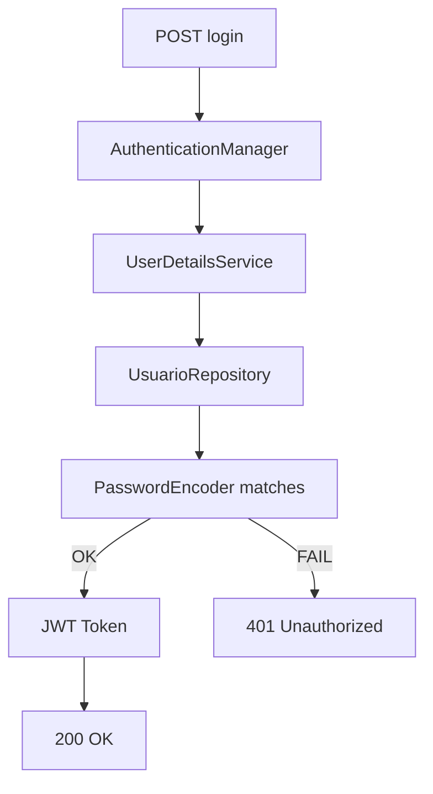
```mermaid
graph TD
    A[POST login] --> B[AuthenticationManager]
    B --> C[UserDetailsService]
    C --> D[UsuarioRepository]
    D --> E[PasswordEncoder matches]
    E -->|OK| F[JWT Token]
    E -->|FAIL| G[401 Unauthorized]
    F --> H[200 OK]
```

___
🛡️ Flujo de Autenticación (Vista Técnica)
Para garantizar la máxima seguridad en el acceso, el sistema implementa un flujo de autenticación por capas,
desacoplando la lógica de base de datos de la lógica de cifrado.

Interacción de Componentes:
Client & Controller: El punto de entrada recibe los datos y delega la responsabilidad al motor de seguridad.

AuthenticationManager: Actúa como el orquestador principal del proceso.

UserDetails & Repository: Se encargan de la persistencia, recuperando el perfil del usuario de forma segura.

PasswordEncoder (BCrypt): Realiza la validación mediante comparación de hashes, asegurando que las contraseñas nunca
viajen ni se comparen en texto plano.

JWTProvider: Una vez confirmada la identidad, este componente firma un token criptográfico que servirá como llave para
el resto de los endpoints.

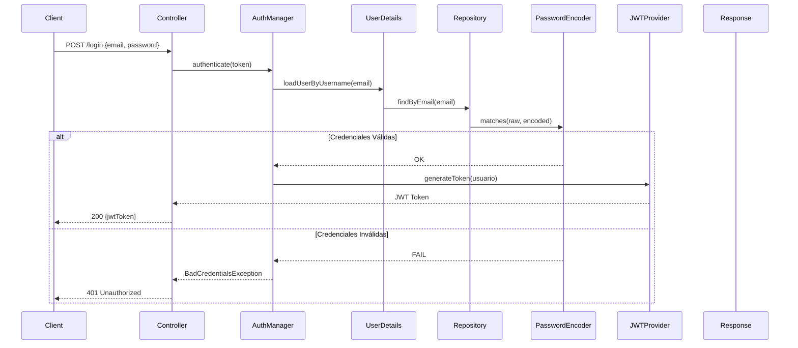
```mermaid
sequenceDiagram
    participant Client
    participant Controller
    participant AuthManager
    participant UserDetails
    participant Repository
    participant PasswordEncoder
    participant JWTProvider
    participant Response
    Client ->> Controller: POST /login {email, password}
    Controller ->> AuthManager: authenticate(token)
    AuthManager ->> UserDetails: loadUserByUsername(email)
    UserDetails ->> Repository: findByEmail(email)
    Repository ->> PasswordEncoder: matches(raw, encoded)
    alt Credenciales Válidas
        PasswordEncoder -->> AuthManager: OK
        AuthManager ->> JWTProvider: generateToken(usuario)
        JWTProvider -->> Controller: JWT Token
        Controller -->> Client: 200 {jwtToken}
    else Credenciales Inválidas
        PasswordEncoder -->> AuthManager: FAIL
        AuthManager -->> Controller: BadCredentialsException
        Controller -->> Client: 401 Unauthorized
    end
```

___
🔒 Sistema de Autenticación y Seguridad JWT
El proyecto implementa un flujo de autenticación robusto basado en Spring Security y JSON Web Tokens (JWT). Este
mecanismo garantiza que solo los usuarios registrados puedan interactuar con los recursos protegidos del foro.

Componentes Clave:
Gestión de Identidad: El AuthenticationManager coordina el proceso de validación, delegando la búsqueda de usuarios en
el Repository.

Seguridad de Credenciales: Las contraseñas nunca se almacenan en texto plano; se utiliza PasswordEncoder para verificar
los hashes de forma segura.

Sesiones Stateless: Tras una validación exitosa, el JWTProvider genera un token firmado. Esto permite que el cliente
realice peticiones autenticadas sin necesidad de mantener una sesión en el servidor.

Manejo de Errores: El sistema distingue claramente entre credenciales válidas e inválidas, retornando códigos de estado
HTTP precisos (200 OK vs 401 Unauthorized) para mejorar la seguridad y la experiencia del desarrollador (DX).
___

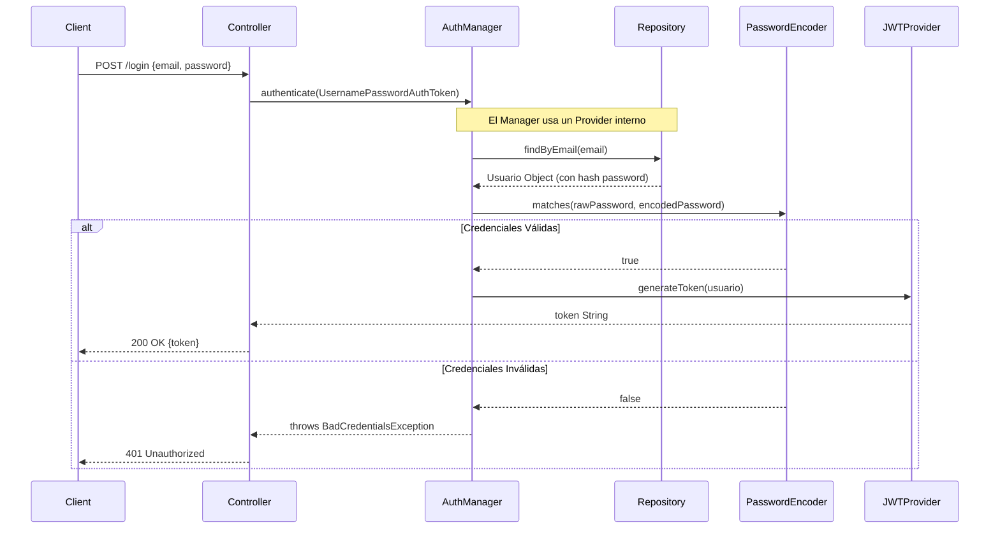
```mermaid
sequenceDiagram
    participant Client
    participant Controller
    participant AuthManager
    participant Repository
    participant PasswordEncoder
    participant JWTProvider
    Client ->> Controller: POST /login {email, password}
    Controller ->> AuthManager: authenticate(UsernamePasswordAuthToken)
    Note over AuthManager, Repository: El Manager usa un Provider interno
    AuthManager ->> Repository: findByEmail(email)
    Repository -->> AuthManager: Usuario Object (con hash password)
    AuthManager ->> PasswordEncoder: matches(rawPassword, encodedPassword)

    alt Credenciales Válidas
        PasswordEncoder -->> AuthManager: true
        AuthManager ->> JWTProvider: generateToken(usuario)
        JWTProvider -->> Controller: token String
        Controller -->> Client: 200 OK {token}
    else Credenciales Inválidas
        PasswordEncoder -->> AuthManager: false
        AuthManager -->> Controller: throws BadCredentialsException
        Controller -->> Client: 401 Unauthorized
    end
```

___

🏗️ Arquitectura de Flujo y Casos de Uso
Esta sección detalla la interacción dinámica entre los componentes del sistema, desde la entrada del cliente hasta la
persistencia de datos, garantizando una separación clara de responsabilidades bajo el patrón MVC y servicios
desacoplados.

Reseña del Sistema:
El diagrama de secuencia describe los cuatro pilares operativos del proyecto:

Autenticación Stateless: Validación de identidad y generación de tokens JWT para sesiones seguras sin estado.

Gestión de Tópicos: Flujo de creación que integra validaciones de existencia de usuarios y cursos antes de la inserción.

Interacción de Comunidad (Respuestas): Proceso de registro de aportaciones vinculado a tópicos específicos.

Consulta Eficiente: Implementación de listados paginados que filtran automáticamente registros inactivos (borrado
lógico), optimizando el consumo de recursos de red y base de datos.

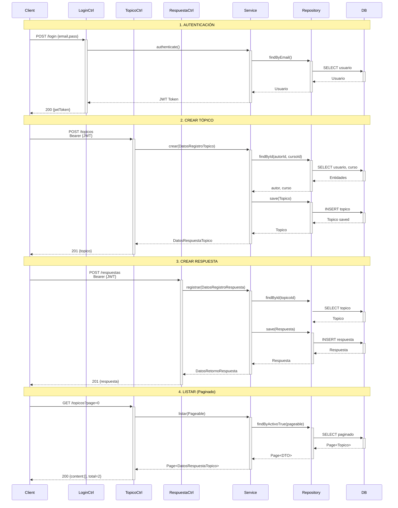
```mermaid
sequenceDiagram
    participant Client
    participant LoginCtrl
    participant TopicoCtrl
    participant RespuestaCtrl
    participant Service
    participant Repository
    participant DB
    Note over Client, DB: 1. AUTENTICACIÓN
    Client ->>+ LoginCtrl: POST /login {email,pass}
    LoginCtrl ->>+ Service: authenticate()
    Service ->>+ Repository: findByEmail()
    Repository ->>+ DB: SELECT usuario
    DB -->>- Repository: Usuario
    Repository -->>- Service: Usuario
    Service -->>- LoginCtrl: JWT Token
    LoginCtrl -->>- Client: 200 {jwtToken}
    Note over Client, DB: 2. CREAR TÓPICO
    Client ->>+ TopicoCtrl: POST /topicos<br/>Bearer {JWT}
    TopicoCtrl ->>+ Service: crear(DatosRegistroTopico)
    Service ->>+ Repository: findById(autorId, cursoId)
    Repository ->>+ DB: SELECT usuario, curso
    DB -->>- Repository: Entidades
    Repository -->>- Service: autor, curso
    Service ->>+ Repository: save(Topico)
    Repository ->>+ DB: INSERT topico
    DB -->>- Repository: Topico saved
    Repository -->>- Service: Topico
    Service -->>- TopicoCtrl: DatosRespuestaTopico
    TopicoCtrl -->>- Client: 201 {topico}
    Note over Client, DB: 3. CREAR RESPUESTA
    Client ->>+ RespuestaCtrl: POST /respuestas<br/>Bearer {JWT}
    RespuestaCtrl ->>+ Service: registrar(DatosRegistroRespuesta)
    Service ->>+ Repository: findById(topicoId)
    Repository ->>+ DB: SELECT topico
    DB -->>- Repository: Topico
    Service ->>+ Repository: save(Respuesta)
    Repository ->>+ DB: INSERT respuesta
    DB -->>- Repository: Respuesta
    Repository -->>- Service: Respuesta
    Service -->>- RespuestaCtrl: DatosRetornoRespuesta
    RespuestaCtrl -->>- Client: 201 {respuesta}
    Note over Client, DB: 4. LISTAR (Paginado)
    Client ->>+ TopicoCtrl: GET /topicos?page=0
    TopicoCtrl ->>+ Service: listar(Pageable)
    Service ->>+ Repository: findByActivoTrue(pageable)
    Repository ->>+ DB: SELECT paginado
    DB -->>- Repository: Page<Topico>
    Repository -->>- Service: Page<DTO>
    Service -->>- TopicoCtrl: Page<DatosRespuestaTopico>
    TopicoCtrl -->>- Client: 200 {content:[], total=2}
```

___

🤖 Moderación Inteligente y Monitoreo de Consumo
El Foro Hub incorpora un sistema de moderación automatizada impulsado por Google Gemini AI, diseñado para garantizar un
entorno colaborativo respetuoso y libre de contenido ofensivo.

Reseña del Proceso:
Validación Proactiva: Antes de persistir cualquier respuesta, el sistema intercepta el contenido y lo somete a un
análisis de sentimiento y lenguaje mediante el ModeratorAI.

Patrón Decorator para Observabilidad: Se implementó un LoggingChatModelDecorator que envuelve las llamadas a la API de
IA. Esto permite registrar en tiempo real métricas críticas como:

Tokens consumidos (Input/Output).

Tiempo de respuesta del modelo.

Metadata del modelo utilizado.

Fallback y Seguridad: El flujo está protegido mediante un bloque condicional; si la IA detecta contenido inapropiado, el
sistema lanza una excepción de validación y bloquea la inserción en la base de datos, retornando un error controlado al
cliente.

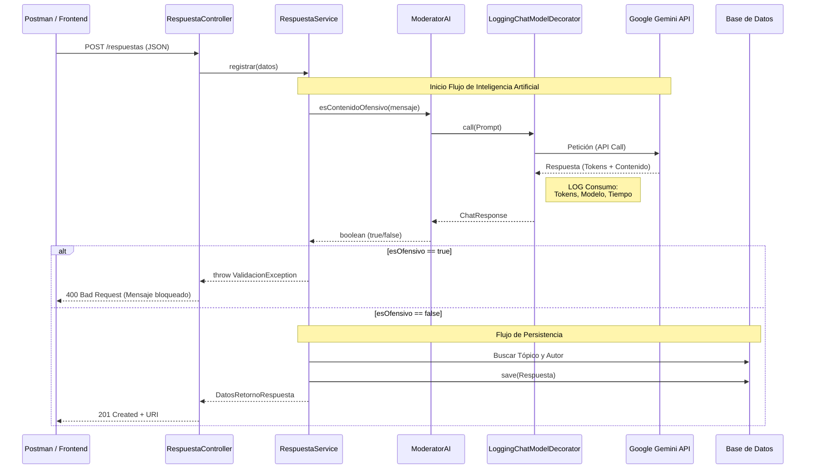
```mermaid
sequenceDiagram
    participant Cliente as Postman / Frontend
    participant Controller as RespuestaController
    participant Service as RespuestaService
    participant Moderador as ModeratorAI
    participant Decorator as LoggingChatModelDecorator
    participant Gemini as Google Gemini API
    participant DB as Base de Datos
    Cliente ->> Controller: POST /respuestas (JSON)
    Controller ->> Service: registrar(datos)
    Note over Service, Gemini: Inicio Flujo de Inteligencia Artificial
    Service ->> Moderador: esContenidoOfensivo(mensaje)
    Moderador ->> Decorator: call(Prompt)
    Decorator ->> Gemini: Petición (API Call)
    Gemini -->> Decorator: Respuesta (Tokens + Contenido)
    Note right of Decorator: LOG Consumo: <br/>Tokens, Modelo, Tiempo
    Decorator -->> Moderador: ChatResponse
    Moderador -->> Service: boolean (true/false)

    alt esOfensivo == true
        Service -->> Controller: throw ValidacionException
        Controller -->> Cliente: 400 Bad Request (Mensaje bloqueado)
    else esOfensivo == false
        Note over Service, DB: Flujo de Persistencia
        Service ->> DB: Buscar Tópico y Autor
        Service ->> DB: save(Respuesta)
        Service -->> Controller: DatosRetornoRespuesta
        Controller -->> Cliente: 201 Created + URI
    end
```

___

🏗️ Modelo de Datos Final: Entidades, Relaciones y Persistencia Logica

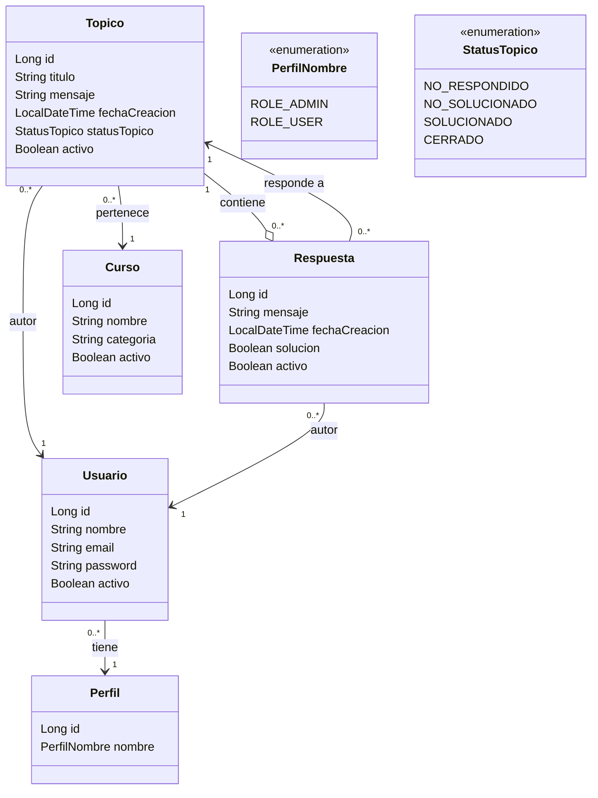
```mermaid
classDiagram
    class Usuario {
        Long id
        String nombre
        String email
        String password
        Boolean activo
    }
    class Perfil {
        Long id
        PerfilNombre nombre
    }
    class Topico {
        Long id
        String titulo
        String mensaje
        LocalDateTime fechaCreacion
        StatusTopico statusTopico
        Boolean activo
    }
    class Respuesta {
        Long id
        String mensaje
        LocalDateTime fechaCreacion
        Boolean solucion
        Boolean activo
    }
    class Curso {
        Long id
        String nombre
        String categoria
        Boolean activo
    }

    class PerfilNombre {
        <<enumeration>>
        ROLE_ADMIN
        ROLE_USER
    }

    class StatusTopico {
        <<enumeration>>
        NO_RESPONDIDO
        NO_SOLUCIONADO
        SOLUCIONADO
        CERRADO
    }

    Usuario "0..*" --> "1" Perfil: tiene
    Topico "0..*" --> "1" Usuario: autor
    Topico "0..*" --> "1" Curso: pertenece
    Respuesta "0..*" --> "1" Topico: responde a
    Respuesta "0..*" --> "1" Usuario: autor
    Topico "1" --o "0..*" Respuesta: contiene
```
___
## Esto visualiza inmediatamente que el sistema es "inteligente" y tiene un plan de respaldo.
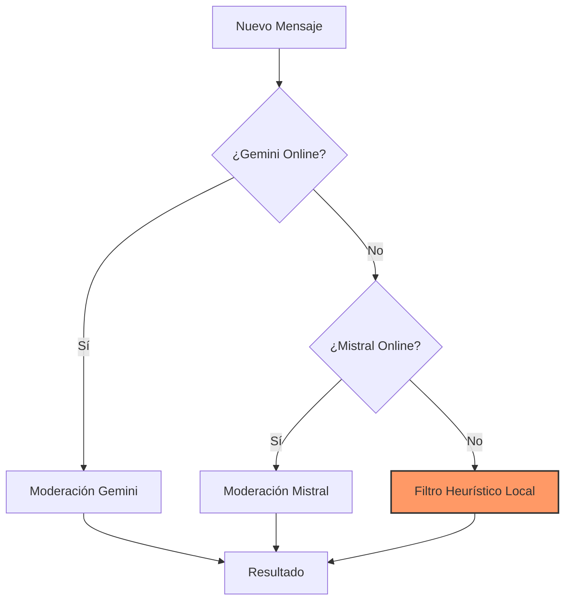
```mermaid
graph TD
A[Nuevo Mensaje] --> B{"¿Gemini Online?"}
B -- Sí --> C[Moderación Gemini]
B -- No --> D{"¿Mistral Online?"}
D -- Sí --> E[Moderación Mistral]
D -- No --> F[Filtro Heurístico Local]
C --> G[Resultado]
E --> G[Resultado]
F --> G[Resultado]
style F fill:#f96,stroke:#333,stroke-width:2px
```
___
[!IMPORTANT]Sistema de Moderación Multicapa (High Availability)    
A diferencia de otros foros, Foro Hub garantiza la integridad del contenido mediante un flujo de decisión en tres niveles:    
* Nivel Primario (Google Gemini): Análisis profundo de contexto y sentimiento.    
* Nivel de Respaldo (Mistral AI): Activación automática en caso de latencia o agotamiento de cuota de Gemini.     
* Nivel de Seguridad Local (Heurístico): Un motor basado en reglas (Java) que asegura que el foro nunca quede desprotegido, incluso sin conexión a internet.    

### 🛡️ Arquitectura de Moderación Multicapa

Para garantizar que el foro sea un espacio seguro y productivo, implementamos un sistema de moderación en cascada que combina lo mejor de la IA con la estabilidad de procesos locales:

| Capa | Tecnología               | Especialidad | Estado |
| :--- |:-------------------------| :--- | :--- |
| **Primaria** | `Gemini 3 flash preview` | Análisis de contexto complejo y sarcasmo | 🌐 Cloud |
| **Secundaria** | `Mistral Large`          | Eficiencia de respuesta y precisión técnica | 🌐 Cloud |
| **Seguridad** | `Heurístico Local`       | Filtro de palabras clave, SPAM y suplantación | 💻 Local (Offline) |
___
## 🚀 Cómo Ejecutar el Proyecto

Sigue estos pasos para tener una instancia local de Foro Hub funcionando en menos de 3 minutos:

1. Requisitos PreviosJava 17 o superior.
2. MySQL 8.0 o superior.Maven (incluido en el proyecto como mvnw).
3. Una API Key de Google Gemini (opcional para la moderación por IA).

## 2. Configuración de Base de Datos

Crea la base de datos en tu terminal de MySQL o Workbench:

````
SQLCREATE DATABASE foro_hub;

````

## 3. Variables de Entorno

Para mantener la seguridad, el proyecto utiliza variables de entorno. Puedes configurarlas en tu IDE (IntelliJ) o en tu
sistema:

| Variable      | Descripción               | Ejemplo                  |
|---------------|---------------------------|--------------------------|
| DB_NAME       | Nombre de la DB           | foro_hub                 |
| DB_USER       | Usuario de MySQL          | tu_usuario               |
| DB_PASSWORD   | Contraseña de MySQL       | tu_password              |
| JWT_SECRET    | Clave secreta para tokens | una_clave_muy_segura_123 |
| PROJECT_ID    | Numero del Proyecto GenAI | gen-lang-client-03....   |
| GEMINI_APIKEY | Key de Gemini (Google AI) | AIzaSy...                |
| MISTRAL_APIKEY| 	Key de Mistral AI        | 	XyZ123...               |

___

## Cómo descargar el proyecto

````
git clone https://github.com/cris959/foro-hub.git
````

## Entra en la carpeta del proyecto:

````
cd foro-hub
````

Compila y ejecuta el archivo

````
ForoHubApplication.java
````

___

# Colaboraciones 🎯

Si deseas contribuir a este proyecto, por favor sigue estos pasos:

1 - Haz un fork del repositorio: Crea una copia del repositorio en tu cuenta de GitHub.  
2 - Crea una nueva rama: Utiliza el siguiente comando para crear y cambiar a una nueva rama:

```bash
git chechout -b feature-nueva
```

3 - Realiza tus cambios: Implementa las mejoras o funcionalidades que deseas agregar.  
4 - Haz un commit de tus cambios: Guarda tus cambios con un mensaje descriptivo:

```bash 
git commit -m 'Añadir nueva funcionalidad'
```

5 - Envía tus cambios: Sube tu rama al repositorio remoto:

````bash
git push origin feature-nueva
````

6 - Abre un pull request: Dirígete a la página del repositorio original y crea un pull request para que revisemos tus
cambios.

Gracias por tu interés en contribuir a este proyecto. ¡Esperamos tus aportes!
___

## 👨‍💻 Autor

Desarrollado con ❤️ por **Christian** (Cris959).  
Si tienes alguna duda sobre este proyecto o quieres conectar para hablar de tecnología, ¡no dudes en contactarme!

[](https://www.linkedin.com/in/christian-ariel-garay)
[](https://github.com/cris959)

---

### 🌟 Agradecimientos

Gracias al programa **Oracle Next Education** y **Alura Latam** por el desafío y las herramientas proporcionadas para
llevar este proyecto al siguiente nivel con Inteligencia Artificial.
___
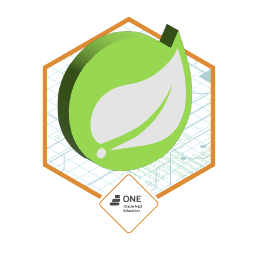
___

## Licencia 📜

Este proyecto está licenciado bajo la Licencia MIT - ver el
archivo [LICENSE](https://github.com/cris959/foro-hub/blob/main/LICENSE) para más detalles.
